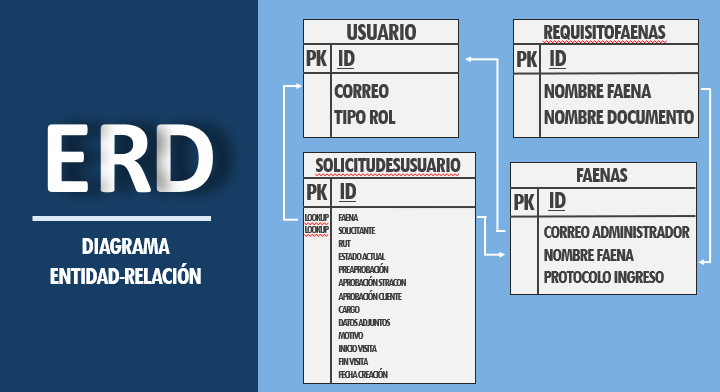

# Visita-Faena-App
Esta aplicación desarrollada en Power Apps permite centralizar y gestionar las solicitudes de visitas a faenas, eliminando la necesidad de correos electrónicos o intermediarios. Los usuarios pueden crear solicitudes a través de un formulario, adjuntar los documentos necesarios y monitorear el estado de su solicitud. Los administradores pueden revisar, aprobar o rechazar las solicitudes en un flujo de tres fases: preaprobación, aprobación por la empresa y aprobación de la faena. Power Automate se utiliza para enviar notificaciones por correo electrónico en cada etapa del proceso, utilizando listas de SharePoint como base de datos.

## **Tecnologías Utilizadas**

 **Power Apps**: Desarrollo de la interfaz de usuario y lógica de la aplicación.
 **Power Automate**: Automatización del flujo de notificaciones por correo electrónico en cada fase del proceso.
 **SharePoint Lists**: Simulación de bases de datos para gestionar usuarios, requisitos de faenas, solicitudes, y documentos adjuntos.

## **Demostración**

### **Usuario**

### **Administrador**

## Pantallas

### **Pantalla de Inicio**

Pantalla mostrada al iniciar la aplicación. La tercera opción solo será visible si el usuario logueado en Teams tiene los permisos de administrador/aprobador especificado en la lista de SharePoint "Usuarios".

### **Pantalla de Administración de Solicitudes**

Esta pantalla está destinada al administrador, quien puede ver el estado de todas las solicitudes pendientes, revisar los documentos adjuntos y gestionar el proceso de aprobación o rechazo.

### **Pantalla de Detalle de Solicitud (Usuario)**

Aquí, el usuario puede ver el estado y los detalles completos de su solicitud, incluidos los documentos adjuntos y las fechas propuestas para la visita.

### **Pantalla de Detalle de Solicitud (Administrador)**

Esta es similar a la pantalla de detalle de solicitud del usuario, pero incluye un panel de control adicional para que el administrador pueda aprobar o rechazar cada fase del proceso.

### **Pantalla de Formulario de Solicitud**

El formulario donde los usuarios completan todos los datos necesarios para crear una nueva solicitud de visita a faenas. Aquí se puede adjuntar la documentación requerida y especificar las fechas de la visita.

### **Pantalla de Solicitudes de Usuario**

Los usuarios pueden visualizar una lista de sus solicitudes pendientes y completadas, con acceso a los detalles de cada solicitud.

### Estructura de las listas de SharePoint:

1.  **Usuarios**: Contiene ID, correo electrónico y rol del usuario.
2.  **Requisitos Faenas**: Contiene ID de faena, nombre de la faena y los documentos requeridos.
3.  **Faenas**: Contiene ID, nombre de la faena, correo del administrador y protocolos de ingreso.
4.  **SolicitudesUsuario**: Contiene información completa sobre las solicitudes de visita, incluidos los datos del solicitante, faena, estado actual, y documentos adjuntos.
